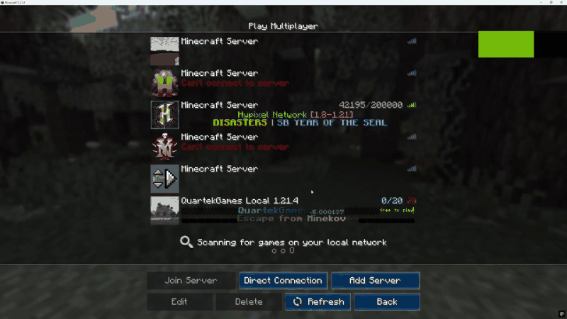

# 🌟 WelcomeAds

[](https://github.com/TiNYsx/WelcomeAds)
[](https://papermc.io/)
[](https://www.spigotmc.org/members/jirwat.457182/)
[](LICENSE)
[](https://discord.gg/JMdjgnzG8W)

**WelcomeAds** is a modern, lightweight Minecraft server plugin designed to display customizable, high-impact welcome screens, announcements, server rules, and interactive promotional menus upon player join or resource pack load.

Supported and designed for seamless integration with custom resource packs and custom GUI glyphs.

<p align="center">
  (Demo)
  
</p>

---

## 📜 License
This project is licensed under the **WelcomeAds Custom License**.

### Summary:
- **You may** download, use, and share this plugin for free.
- **You may not** resell, redistribute, or modify and distribute this plugin.
- **You are allowed** to sell packs or products that depend on this plugin, provided the plugin itself is **not included** and users are directed to download it from the official GitHub repository.
- **Attribution is required** for using this plugin in your product or documentation (Credit to **TiNYsx** / **Nokhongyok**).

For full details, refer to the [LICENSE](LICENSE) file.

---

## ✨ Features

- **🖼️ Cinematic Welcome Screen**:
  - Present announcements, daily rewards, update logs, or store promotions directly on screen.
  - Native inventory-based GUI menus that require zero client-side mods.

- **🧹 Clean Screen Mode (`hide-player-inventory: true`)**:
  - Automatically hides player hotbar and inventory items while the welcome GUI is open for a 100% clean visual presentation.
  - Completely safe: all items and inventory states are preserved and restored instantly upon closing.

- **⏱️ Flexible Triggers & Session Control**:
  - Trigger welcome ads on player join (`onjoin`), after resource pack acceptance (`onresourcepack`), or both (`both`).
  - Configurable `persession: true` to prevent spamming players each time they switch worlds or re-enter.

- **🎨 Multi-Plugin Resource Pack Support**:
  - Native compatibility with **ItemsAdder**, **Oraxen**, and **NexO** font images / emojis.
  - Supports negative space offsets (`%img_offset%` / `%img_shift%`) and full-screen title backgrounds.

- **⚡ PlaceholderAPI Integration**:
  - Full support for dynamic player placeholders, stats, and variables across titles and item descriptions.

---

## 📥 Installation

### Quick Links
- 📖 **[Official Wiki](https://github.com/TiNYsx/WelcomeAds/wiki)**
- 💬 **[Discord Support](https://discord.gg/JMdjgnzG8W)**

### Soft Dependencies
| Dependency | Description |
| :--- | :--- |
| **[PlaceholderAPI](https://www.spigotmc.org/resources/placeholderapi.6245/)** *(Recommended)* | Dynamic placeholders in menus and text |
| **[ItemsAdder](https://www.spigotmc.org/resources/%E2%9C%A8itemsadder%E2%AD%90emotes-mobs-items-armors-hud-gui-emojis-blocks-wings-hats-liquids.73355/)** *(Optional)* | Custom fonts, textures, and HUD/GUI images |
| **[Oraxen](https://www.spigotmc.org/resources/%E2%98%84%EF%B8%8F-oraxen-custom-items-blocks-emotes-furniture-resourcepack-and-gui-1-18-1-21-4.72448/)** *(Optional)* | Custom fonts and resource pack assets |
| **[NexO](https://mcmodels.net/products/13172/nexo)** *(Optional)* | Custom items, furniture, and font images |

### Getting Started
1. Download **`WelcomeAds.jar`** from the [Releases](https://github.com/TiNYsx/WelcomeAds/releases) tab.
2. Place the `.jar` file into your server's `plugins/` directory.
3. Restart or reload your server to generate configuration files.
4. Configure your menus in `plugins/WelcomeAds/` and reload using `/welcomeads reload`.

---

## 🕹️ Commands & Permissions

### Commands
| Command | Description | Permission |
| :--- | :--- | :--- |
| `/welcomeads open <page_name> [player]` | Opens a specific welcome ad screen | `welcomeads.open` (for others) / `welcomeads.use` |
| `/welcomeads reload` | Reloads all configurations and inventories | `welcomeads.reload` |

### Permissions
- `welcomeads.use` *(Default: true)* - Allows players to view and interact with welcome screens.
- `welcomeads.open` *(Default: op)* - Allows administrators to open welcome screens for other players.
- `welcomeads.reload` *(Default: op)* - Allows reloading plugin configurations.

---

## ⚙️ Configuration Preview

Sample `plugins/WelcomeAds/config.yml`:

```yaml
# Default page displayed to players
joinpage: "welcome-1"

# Trigger event: "onjoin", "onresourcepack", or "both"
loadtype: "onjoin"

# Show only once per server session
persession: true

# Temporarily hide player inventory items for a clean cinematic view
hide-player-inventory: true

# Permission required to reload
permission: "welcomeads.reload"

# Global fallback background image & title timing
global-background:
  text: "&0%img_welcomeads_shift_l_1536%&e%img_welcomeads_background%&0%img_welcomeads_shift_l_1014%"
  fadein: 0
  stay: 0
  fadeout: 10
```

---

## 🤝 Contributions
Contributions and feedback are welcome! Please submit a pull request or open an issue on the official GitHub repository.

---

## 💬 Support & Contact
- **Developer:** **TiNYsx** (*Nokhongyok*)
- **Discord:** `tiny.tinysx`
- **Discord Support Server:** [Join Discord](https://discord.gg/JMdjgnzG8W)
